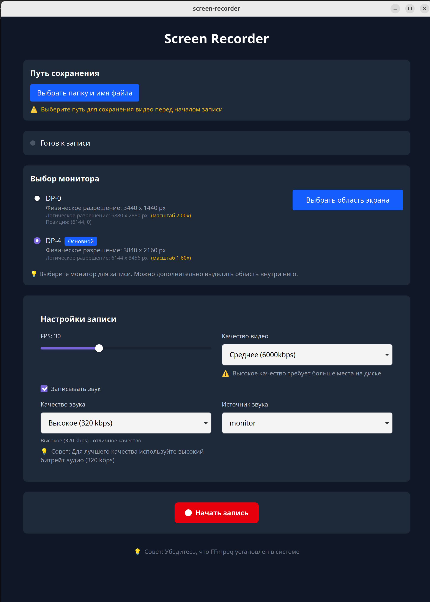
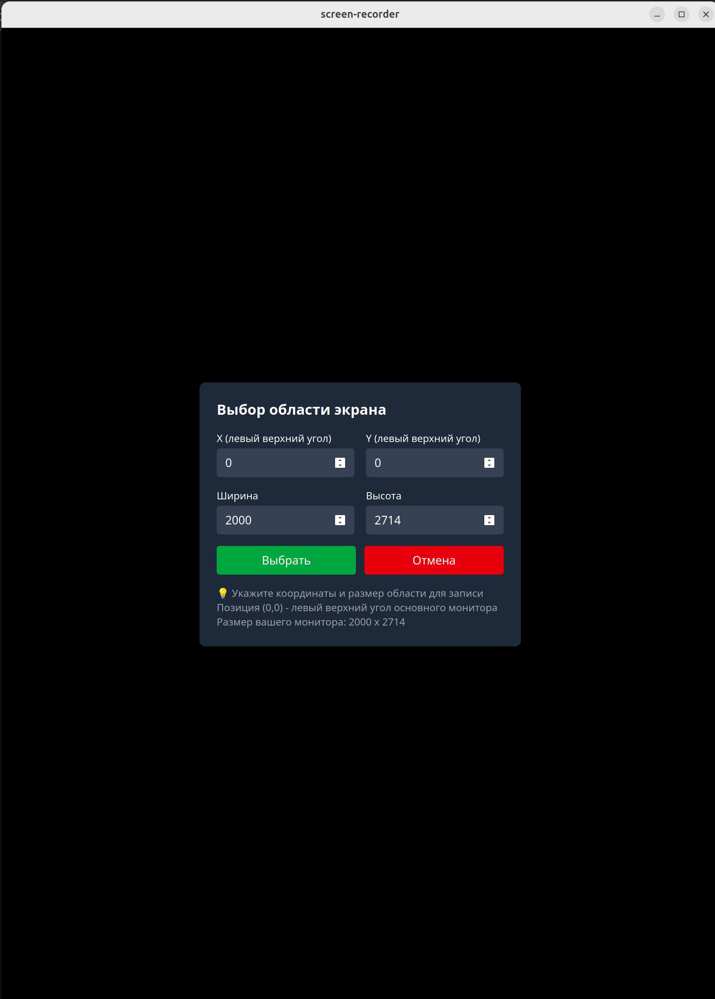

# Screen Recorder

[](https://tauri.app)
[](https://rust-lang.org)
[](https://reactjs.org)
[](LICENSE)

Профессиональное десктопное приложение для записи экрана с поддержкой нескольких мониторов, аудио и выбора области записи.

https://github.com/avkis/screen_recorder.git

## Возможности

- 🖥️ **Запись экрана** – захват всего экрана или выбранной области
- 🎧 **Запись звука** – системный звук и/или микрофон
- 🖱️ **Поддержка нескольких мониторов** – выбор активного монитора для записи
- 📐 **Масштабирование HiDPI** – корректная работа с 4K мониторами
- 🎚️ **Настройка качества** – выбор FPS и битрейта видео (низкое, среднее, высокое, без потерь)
- 🔊 **Выбор качества аудио** – от 96 kbps до FLAC без потерь
- 📁 **Сохранение в любой каталог** – выбор пути и имени файла через диалог
- 🎬 **Интеграция с системой** – открытие записанного видео в стандартном плеере

## Скриншоты

| Главное окно | Выбор области |
|--------------|---------------|
|  |  |

## Системные требования

### Поддерживаемые операционные системы
- **Linux** (Ubuntu 20.04+, Debian 11+, Fedora 36+)
- Windows 10/11 (в разработке)
- macOS 11+ (в разработке)

### Необходимые системные зависимости

#### Ubuntu / Debian
```bash
# Базовые зависимости Tauri
sudo apt update
sudo apt install -y \
    libwebkit2gtk-4.1-dev \
    build-essential \
    curl \
    wget \
    file \
    libssl-dev \
    libgtk-3-dev \
    libayatana-appindicator3-dev \
    librsvg2-dev

# Зависимости для захвата экрана и аудио
sudo apt install -y \
    ffmpeg \
    pulseaudio \
    libpulse-dev \
    x11-utils \
    xdg-utils
```

#### Fedora
```bash
sudo dnf groupinstall "C Development Tools and Libraries"
sudo dnf install -y \
    webkit2gtk4.0-devel \
    openssl-devel \
    gtk3-devel \
    libappindicator-gtk3-devel \
    librsvg2-devel \
    ffmpeg \
    pulseaudio-libs-devel \
    xrandr \
    xdg-utils
```

#### Arch Linux
```bash
sudo pacman -S --needed \
    base-devel \
    webkit2gtk \
    openssl \
    gtk3 \
    libappindicator-gtk3 \
    librsvg \
    ffmpeg \
    pulseaudio \
    xorg-xrandr \
    xdg-utils
```

### Проверка установки FFmpeg
```bash
ffmpeg -version
```


## Установка

### Предварительные требования для разработки
1. Rust (последняя стабильная версия)
```bash
curl --proto '=https' --tlsv1.2 -sSf https://sh.rustup.rs | sh
source ~/.cargo/env
```

2. Node.js (версия 18 или выше)
```bash
# Ubuntu/Debian
curl -fsSL https://deb.nodesource.com/setup_20.x | sudo -E bash -
sudo apt install -y nodejs
```

3. pnpm (менеджер пакетов)
```bash
npm install -g pnpm
```

## Сборка из исходников
```bash
# Клонирование репозитория
git clone https://github.com/avkis/screen_recorder.git
cd screen-recorder

# Установка зависимостей
pnpm install

# Запуск в режиме разработки
pnpm tauri dev

# Сборка production версии
pnpm tauri build
```
После выполнения `pnpm tauri build` установщики и исполняемые файлы будут находиться в папке `src-tauri/target/release/bundle/`

## Использование

### 🐧 Запуск на Linux

#### Способ 1: AppImage (рекомендуется для тестирования)
AppImage — это самодостаточный формат, который не требует установки и работает на большинстве дистрибутивов.

```bash
# 1. Перейдите в папку с AppImage
cd src-tauri/target/release/bundle/appimage/

# 2. Сделайте файл исполняемым
chmod a+x screen-recorder_*.AppImage

# 3. Запустите приложение
./screen-recorder_*.AppImage
```

**Преимущества AppImage:88
- Не требует установки — работает "из коробки"
- Подходит для распространения
- Содержит все зависимости внутри

**Недостатки:**
- Больший размер файла (70+ МБ)
- Медленнее запускается

### Способ 2: Debian пакет (.deb)
Подходит для пользователей Ubuntu/Debian и производных систем.

```bash
# 1. Перейдите в папку с deb-пакетом
cd src-tauri/target/release/bundle/deb/

# 2. Установите пакет
sudo dpkg -i screen-recorder_*.deb

# 3. Если есть ошибки зависимостей, исправьте их
sudo apt-get install -f
```

После установки приложение появится в меню вашего рабочего окружения. Запустить можно командой:

```bash
screen-recorder
```

### Способ 3: Запуск бинарного файла напрямую (для разработки)

```bash
cd src-tauri/target/release/
./screen-recorder
```

#### 💡 Важные замечания

##### О системных зависимостях
Даже после сборки приложению потребуются установленные в системе библиотеки:

- FFmpeg — для записи экрана и звука (должен быть установлен в системе)
- WebKit2GTK — для отображения интерфейса
- PulseAudio — для захвата звука

##### Рекомендации по распространению
Для тестирования — используйте AppImage, его легко запустить без установки

Для конечных пользователей — лучше подготовить deb-пакет, он лучше интегрируется в систему

#### Если AppImage не запускается
Убедитесь, что файл имеет права на выполнение:

```bash
chmod a+x *.AppImage
```

Если появляется ошибка GLIBC_2.33 not found, это означает, что ваша система слишком старая. Придется собирать приложение на более старой базовой системе.

#### 📦 Структура папки bundle
```text
src-tauri/target/release/bundle/
├── appimage/
│   └── screen-recorder_*.AppImage    # Самодостаточный исполняемый файл
├── deb/
│   └── screen-recorder_*.deb          # Пакет для Debian/Ubuntu
└── (другие форматы, если настроены)
```

### Первый запуск
1. Запустите приложение
1. При первом запуске может потребоваться подтверждение разрешений (микрофон, экран)
1. Выберите папку для сохранения видео (по умолчанию – ~/Downloads)

### Основной интерфейс
1. Выбор монитора
- Приложение автоматически определяет все подключенные мониторы
- Выберите монитор для записи из выпадающего списка
- Основной монитор отмечен значком "Основной"

2. Настройки записи
- FPS (кадров в секунду) – от 15 до 60, влияет на плавность видео
- Качество видео:
  - Низкое (3000 kbps) – для скринкастов, малый размер файла
  - Среднее (6000 kbps) – оптимальный баланс (по умолчанию)
  - Высокое (12000 kbps) – для записи игр и видео высокого качества
  - Без потерь (50000 kbps) – максимальное качество, большой размер
- Запись звука – включение/выключение аудиодорожки
- Источник звука – выбор устройства (системный звук, микрофон)
- Качество звука:
  - Низкое (96 kbps) – для речи, экономия места
  - Среднее (192 kbps) – хорошее качество для музыки
  - Высокое (320 kbps) – отличное качество
  - Без потерь (FLAC) – максимальное качество, большой размер

3. Выбор области записи
- Нажмите "Выбрать область экрана"
- Укажите координаты и размер области
- Предварительный просмотр покажет, как будет выглядеть запись

4. Управление записью
- Начать запись – красная кнопка с кругом
- Пауза/Возобновить – жёлтая/зелёная кнопка
- Остановить запись – красная кнопка с квадратом

5. После остановки записи
- Показывается путь к сохранённому файлу
- Кнопка "Открыть видео" запускает файл в системном плеере
- Кнопка "Копировать путь" сохраняет путь в буфер обмена

## Решение проблем

### FFmpeg не найден
Ошибка: Не удалось начать запись. Убедитесь, что установлен FFmpeg.

Решение:
```bash
# Проверьте установку
ffmpeg -version

# Если не установлен:
sudo apt install ffmpeg  # Ubuntu/Debian
sudo dnf install ffmpeg  # Fedora
```

### Нет звука в записи
Причина: Выбран неправильный источник звука

Решение:

1. Проверьте, включена ли опция "Записывать звук"
1. В настройках выберите правильный источник:
    - Для системного звука – устройство с .monitor в названии
    - Для микрофона – устройство с input в названии

### Записывается не весь экран
Причина: Проблема с масштабированием HiDPI

Решение:

Выберите монитор из списка (приложение автоматически определит масштаб)

Если автоопределение не работает, укажите область вручную

Не работает предпросмотр видео
Причина: Ограничения безопасности Tauri

Решение:
Используйте кнопку "Открыть видео" – файл откроется в системном плеере

### Ошибка доступа к микрофону на Linux
Решение:
```bash
# Добавьте пользователя в группу pulse-access
sudo usermod -a -G pulse-access $USER
# Перезагрузитесь или перелогиньтесь
```

## Горячие клавиши

|Действие	|Комбинация |
|:---|:---|
|Начать запись	|Ctrl + R (планируется)|
|Остановить запись	|Ctrl + S (планируется)|
|Пауза/Возобновить	|Ctrl + P (планируется)|

## Структура проекта
```text
screen-recorder/
├── src/                    # Frontend (React + TypeScript)
│   ├── components/         # React компоненты
│   │   ├── AreaSelector.tsx
│   │   ├── MonitorSelector.tsx
│   │   ├── RecordingControls.tsx
│   │   ├── Settings.tsx
│   │   ├── StatusIndicator.tsx
│   │   └── VideoPreview.tsx
│   ├── App.tsx
│   └── main.tsx
├── src-tauri/              # Backend (Rust)
│   ├── src/
│   │   ├── commands/       # Tauri команды
│   │   │   ├── audio.rs
│   │   │   ├── mod.rs
│   │   │   ├── recording.rs
│   │   │   └── video.rs
│   │   ├── services/       # Бизнес-логика
│   │   │   ├── ffmpeg.rs
│   │   │   ├── mod.rs
│   │   │   └── system.rs
│   │   ├── state/          # Управление состоянием
│   │   ├── lib.rs
│   │   └── main.rs
│   ├── capabilities/       # Разрешения
│   └── Cargo.toml
└── package.json
```

## Технологический стек
|Компонент	|Технология	|Назначение|
|:---|:---|:---|
|Frontend	|React 19 + TypeScript	|Пользовательский интерфейс|
|Стили	|TailwindCSS	|Стилизация компонентов|
|Backend	|Rust	|Системные вызовы, FFmpeg|
|Десктоп	|Tauri 2	|Кроссплатформенная обёртка|
|Захват видео	|FFmpeg (x11grab)	|Запись экрана|
|Захват аудио	|PulseAudio + FFmpeg	|Запись звука|
|Информация о дисплеях	|xrandr / xdpyinfo	|Определение мониторов|

### Известные ограничения
1. Wayland: полная поддержка требует дополнительной настройки (запуск через XWayland)
1. macOS / Windows: в стадии разработки
1. Выбор области: пока только ручной ввод координат (интерактивный режим в планах)

## Лицензия
MIT License 

## Благодарности
- [Tauri](https://tauri.app/) – за отличный фреймворк
- [FFmpeg](https://ffmpeg.org/) – за мощные инструменты для работы с медиа


## Поддержка
При обнаружении ошибок или для предложений по улучшению, пожалуйста, создайте Issue на GitHub.